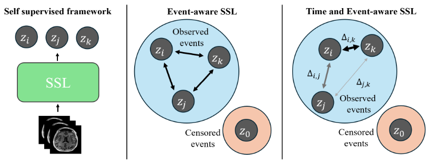
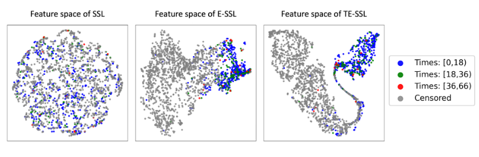

# TE-SSL: Time and Event-Aware Self-Supervised Learning for Alzheimer's Disease Progression Analysis

This repository contains supplementary code for [Time and Event-Aware Self-Supervised Learning for Alzheimer's Disease Progression Analysis](https://arxiv.org/abs/2407.06852), published in The Medical Image Computing and Computer Assisted Intervention Society (MICCAI) 2024. In this work, we analyze the effect of incorporating time and event labels to a self-supervised pretraining pipeline for survival analysis of Alzheimer's Dementia.

<p align="center">
  
</p>

Figure: Schematic diagram of the proposed time- and event-aware SSL, where $`\Delta_{*, *}`$ represents the time difference between two embedded data elements $`z_*`$


## Loss Function

Usage:
```python
from lib.Loss import TESSL_Loss

# alpha and beta define maximum and minimum weight
loss_fn = TESSL_loss(alpha=1, beta=0.5)

# features in [batch_size, n_views, dim]
# events, times in [batch_size]
tessl_loss = loss_fn(features, labels=events, times=times)

# Compute SupCon by excluding times
supcon_loss = loss_fn(features, labels=events, times=None)

# Compute SimCLR by exluding events and times
simclr_loss = loss_fn(features, labels=None, times=None)
```

## Data

Our data consists of a cohort of 493 unique patients from the ADNI dataset ([link](https://adni.loni.usc.edu/)). Specific data splits can be found in `datasets/files` folder. Images were preprocessed via Clinica according to process define in "Generalizable deep learning model for early Alzheimer's Disease detection from structural MRIs". Refer to [here](https://github.com/NYUMedML/CNN_design_for_AD/tree/master) for more details


## Discriminative results

Comparison against regular SSL, Event-Aware SSL and No Pretaining baseline. Results averaged across 3 seeds
| Method         | C-td   | IBS    |
|----------------|--------|--------|
| No Pretraining | 0.7329 | 0.2099 |
| SSL            | 0.7511 | 0.1985 |
| E-SSL          | 0.7720 | 0.1997 |
| TE-SSL         | 0.7873 | 0.1889 |


## Embedding visualization

t-SNE visualization demonstrates superior seperability for TE-SSL embeddings compared to SSL and E-SSL.

<p align="center">
  
</p>
Figure: t-SNE analysis of feature representations captured by the projection head across different SSL frameworks. Individual points, if nto censored, are labeld with different time-to-event groups

## Reference
```
@misc{thrasher2024tessltimeeventawareself,
      title={TE-SSL: Time and Event-aware Self Supervised Learning for Alzheimer's Disease Progression Analysis}, 
      author={Jacob Thrasher and Alina Devkota and Ahmed Tafti and Binod Bhattarai and Prashnna Gyawali},
      year={2024},
      eprint={2407.06852},
      archivePrefix={arXiv},
      primaryClass={cs.CV},
      url={https://arxiv.org/abs/2407.06852}, 
}
```
